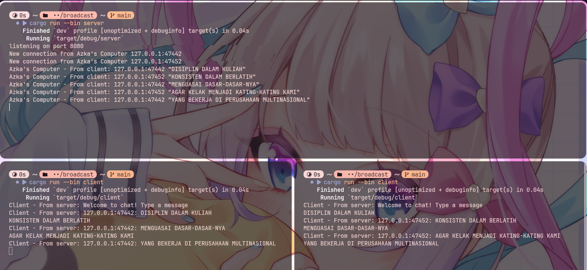

# Module 10: Asynchronous Programming (Broadcast) Reflection

## Experiment 2.1: Original code, and how it run

Program dijalankan dengan membuka satu terminal untuk server memakai cargo run --bin server, lalu beberapa terminal lain untuk client memakai cargo run --bin client. Setelah server aktif, setiap client bisa mengetik pesan dari terminalnya masing-masing, lalu pesan itu dikirim ke server dan diteruskan ke client lain yang sedang terhubung. Dari percobaan ini terlihat kalau server berfungsi sebagai penghubung broadcast, jadi pesan yang dikirim dari satu client bisa langsung muncul di client lain secara real-time.

## Experiment 2.2: Modifying port

Pada percobaan ini port websocket diubah dari 2000 menjadi 8080. Perubahan perlu dilakukan di dua sisi, yaitu di server pada bagian TcpListener::bind("127.0.0.1:8080") dan di client pada bagian ClientBuilder::from_uri(Uri::from_static("ws://127.0.0.1:8080")). Protokol yang dipakai tetap ws, jadi yang berubah hanya nomor port agar alamat koneksi server dan client tetap sama.

